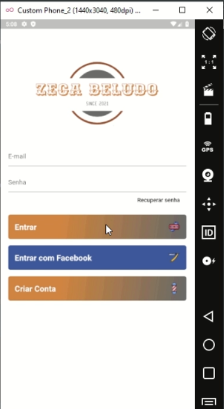
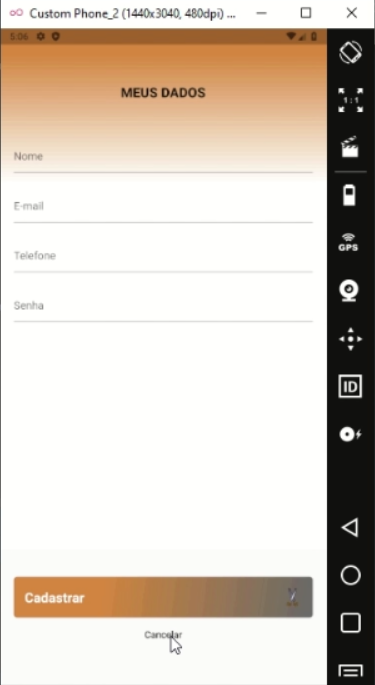
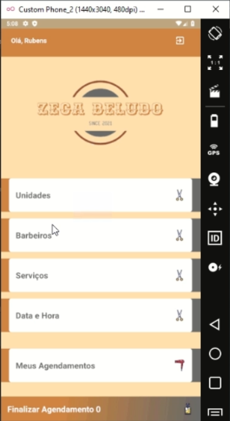
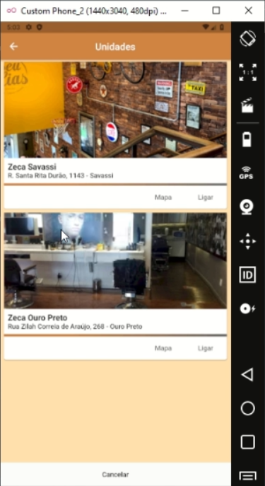
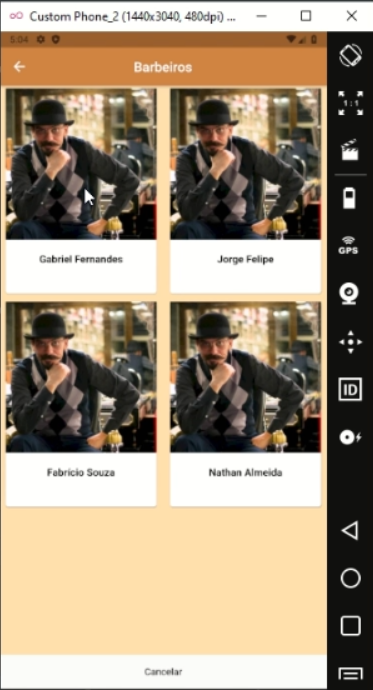
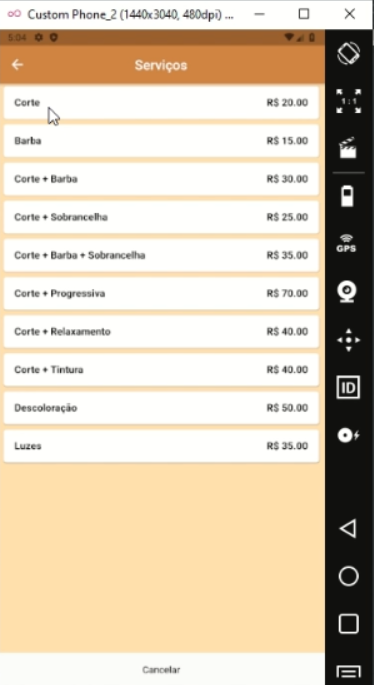
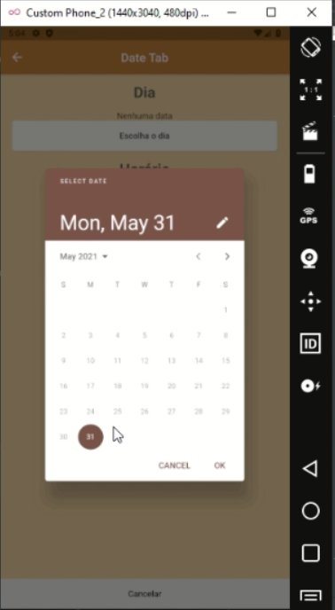
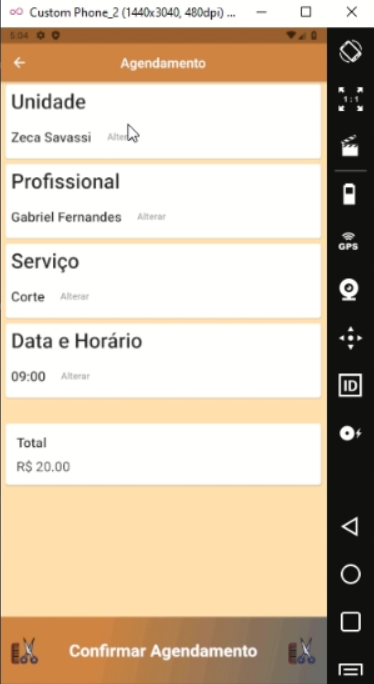
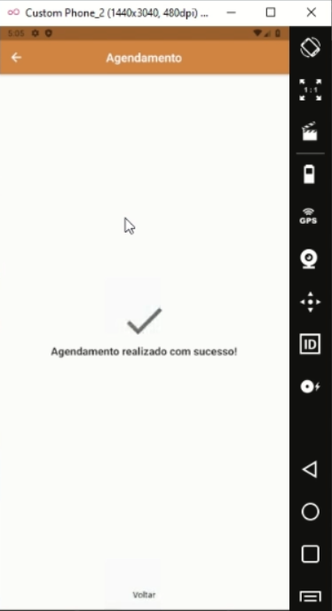

# Avaliação da Aplicação

Os testes a serem realizados são nas funcionalidades das seguintes telas/funções:
- Login;
- Tela Serviço;
- Seleção Unidade;
- Seleção Serviços;
- Seleção Barbeiro;
- Seleção Data/Hora;
- Tela de Confirmação do pedido;
- Tela Confirmado, com disparo do invite.

## Plano de Testes

Os testes escolhidos para serem aplicados no APP Barbearia são:
- o teste de usabilidade – nesse teste é feito por um pequeno grupo de usuários para ver se o software satisfaz as suas necessidades.  Nesse teste analisa-se como o usuário usa o sistema, verificando onde ele tem mais dificuldade. Ouve-se também suas impressões, porém é preciso confrontá-las com as observações do avaliador. No caso do projeto, os usuários que realizam teste são o PO e os Devs a medida que o app foi sendo desenvolvido e entregue;
- Teste de regressão – esse consiste em realizar testes a cada versão de um software, onde se modificam-se funcionalidades. Desse modo, evita-se que erros que foram corrigidos antes no software antes voltem a aparecer na hora de se incrementar algo novo a ele. Então toda nova submissão, todo o app é testado, muito por conta do tamanho do projeto;
- Teste de integração: Firebase para armazenamento e recuperação de informações, e Google Calendar para disparo de invites.

Estudo do Projeto:
Desenvolvimento da aplicação, vislumbrando:
- desenvolvimento das telas;
- configuração do projeto para usar o Firebase;
- integração com o Google Calendar.

Avaliação de impacto:
- Não há, visto que não existe publicação em produção.

Avaliação de esforço:
Através da entrega em sprints, foi levantado o esforço para primeira entrega (sprint 2):
- Login - 4 horas
- Tela Serviço - 8 horas
- Seleção Unidade - 4 horas
- Seleção Serviços - 3 horas
- Seleção Barbeiro - 3 horas
- Seleção Data/Hora - 5 horas
- Tela de Confirmação do pedido - 4 horas
- Tela Confirmado, com disparo do invite - 3 horas 
- Teste por tela - 1 hora x 8 = 8 horas
Total: 42 horas para sprint 2.

Aprovação do Planejamento:
- Integrantes, entre eles devs e PO.

Definição de responsabilidade:
- Devs: Desenvolvimento da aplicação, colaboração e testes;
- PO: Scrum master, gestor do projeto e colaboração.

Dinâmica das Macro-Atividades:
- Definição de projeto >> Definição de Requisitos >> Desenvolvimento >> Testes

## Avaliação

Teste do Software

1- Tela de apresentação:

a) Sem testes a serem realizados, uma vez que trata-se apenas de animação.

2- Tela de login: 

a) Sem problemas no preenchimento de usuário e senha;

b) Usuário e senha não reconhecidos geram crítica corretamente;

c) Login correto direciona à tela de Serviços;

d) Recuperar senha exige que o campo de email esteja preenchido, gerando uma mensagem na parte de baixo da tela requisitando o devido preenchimento;

e) Ao clicar no botão Criar Conta direciona corretamente para a tela de Cadastro.

3- Tela de Cadastro:

a) Preenchimento dos campos funciona corretamente;

b) Cadastro apresentou falha no momento do teste, tendo a inclusão do cadastro realizada com sucesso no banco de dados, porém a tela ficou carregando em loop. Necessário reinício do app para prosseguir.

c) Botão Cancelar retorna a tela anterior.

4- Tela de seleção de atendimento:

a) Apresenta todas as opções de Unidades, Barbeiros, Serviços, Data e Hora disponíveis, juntamente com as informações de histórico de agendamento, e botão de Finalizar Agendamento;

b) Botão de retornar no canto superior direito retorna à tela anterior de login;

c) Botão de Finalizar Atendimento está diponível o tempo todo, apresentando um contador para mostrar quantas opções foram selecionadas. Após clicar, ele direciona para uma tela confimarmando a marcação;

d) Botão Limpar todas as seleções reseta todos os dados escolhidos nesta tela.

5- Tela de Unidades

a) Mostra corretamente as unidades cadastradas, com botões de Mapa e Ligar;

b) Ao clicar no botão de Mapa, direciona para o Google Maps para o local cadastrado;

c) Ao clicar no botão de Ligar, direciona para o telefone do smatphone;

d) Ao clicar no botão Cancelar, retorna para a tela anterior sem a seleção de nenhuma localidade ou mantendo a localidade já selecionada;

e) Ao clicar em uma das unidades, a seleção estará realizada e retorna a tela anterior.

6- Tela de Barbeiros

a) Mostra todos os barbeiros disponíveis com foto. Ao clicar em um deles, a seleção estará realizada e retorna a tela anterior;

b) Ao clicar no botão Cancelar, retorna para a tela anterior sem a seleção de nenhum barbeiro ou mantendo o barbeiro já selecionado.

7- Tela de Serviços

a) Mostra todos os serviços. Ao clicar em um deles, a seleção estará realizada e retorna a tela anterior;

b) Ao clicar no botão Cancelar, retorna para a tela anterior sem a seleção de nenhum serviço ou mantendo o serviço já selecionado. Observação: só permite um serviço por vez.

8- Tela Date Hora

a) Permite seleção de uma data abrindo um calendário, e um intervalo de hora disponível para marcação de serviço. Não foi verificado disponibilidade;

b) Ao clicar no botão Cancelar, retorna para a tela anterior sem a seleção de nenhuma data ou mantendo a já selecionada.

9- Tela Agendamento

a) Botão de voltar localizado na parte de cima, à esquerda retorna a tela anterior, conforme esperado;

b) A tela mostra um resumo de todas as opções selecionadas na tela anterior e preço do serviço;

c) Botão Criar Agendamento provoca mudança de tela. Observação: esse botão deve disparar um invite para o email do usuário.

10- Tela de Confirmação

a) Tela mostra mensagem de confimação do agendamento.

b) Botão de voltar localizado na parte de cima, à esquerda, e na parte inferior da tela retorna a tela anterior, conforme esperado.

## Conclusão

O aplicativo apresenta bonita estética, tem tempo de resposta baixo para grande parte das funções que apresenta, e é promissor para seu objetivo. Porém está inacabado, e necessita de polimento em algumas telas, como por exemplo:
- botão de login pelo Facebook deve ser retirado;
- na tela de agendamento deve enviar o invite via email para o usuário.

Da maneira como está, o aplicativo não pode ir à produção.

## Teste de usabilidade

# Fases do teste de usabilidade:
O usuário deverá ser capaz de:
- Cadastrar usuário
- Trocar a senha
- Realizar login
- Escolher local para atendimento
- Escolher barbeiro
- Escolher serviço
- Escolher data e hora do atendimento
- Confirmar marcação de serviço
- Checar marcação atual e antigas

# Projeto das atividades de teste

# Recrutamento de participantes:
- Serão selecionados 5 participantes que desejam fazer marcações de barbeiro, e não tiveram contato com o app anteriormente para não ter sua opinião "Contaminada".

# Preparação de materiais necessários:
- O usuário deve ter um smatphone Android 5.0 ou superior

# Configuração do ambiente de teste:
- O usuário deve instalar a APK em seu smartphone, que obedeça a condição de material anterior.

# Condução do teste
Após explicação inicial sobre o aplicativo, o usuário terá que ser capaz de utilizar o aplicativo sem intervenção. Caso o usuário não consiga realizar os passos e agendar o serviço, deve pedir ajuda, e o aplicativo é considerado pouco intuitivo, não atendendo um de seus requisitos não funcionais.

# Compilação e análise dos dados coletados.
Após a coleta das respostas dos usuários sobre a utilização de cada uma das funções, será realizado uma compilação das respostas, evidenciando em métricas se o feedback foi positivo e o aplicativo deverá ser revisto.
